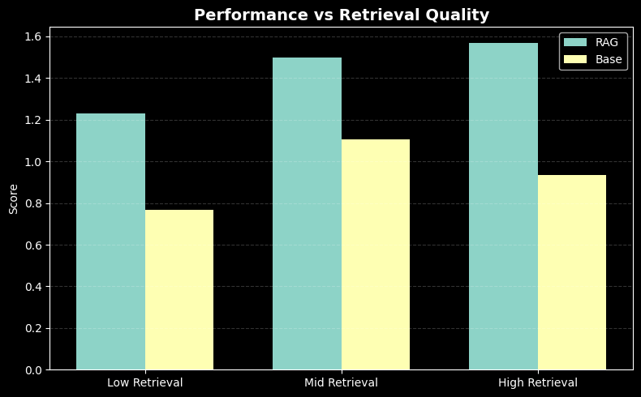

# RootCause

RootCause is an MCP-powered debugging engine for Python codebases.
Instead of guessing fixes with a generic LLM, it retrieves real bug fixes from open-source repositories and uses them as context to generate grounded, reliable patches.

Built for CLI and assistant integration, RootCause plugs directly into your workflow and turns historical bug data into actionable fixes — fast, cheap, and far less prone to hallucination.
Because in real codebases, bugs aren’t unique — they repeat. RootCause makes sure your fixes don’t have to start from zero.

---

## Why RootCause?

Most bugs are not truly new. In large codebases, the same failure patterns show up again and again:

- missing `None` checks
- API misuse
- scope and type errors
- bad exception handling
- logic mistakes and boundary issues

A standard LLM can guess a fix, but RootCause looks at real historical patches first. If a similar bug exists in the corpus, it retrieves that fix and uses it to anchor the final response.

That makes the system:

- more grounded
- less hallucination-prone
- cheaper to run than purely frontier-model-based debugging
- better suited for repeated bug patterns in production codebases

---

## Key Features

- **Retrieval-augmented debugging** for Python codebases
- **Real bug-fix corpus** built from open-source repositories
- **LLM-based parsing and normalization** of raw GitHub diffs into structured records
- **FAISS vector search** for fast similarity lookup
- **Confidence gating** to skip weak retrievals and fall back gracefully
- **MCP server integration** so the system can plug into coding assistants and CLI workflows
- **Structured JSON outputs** for downstream automation

---

## How It Works

### 1. Collect bug-fix examples
The dataset is built from bug-fix pull requests and commits from major Python repositories such as Django, Pandas, Flask, and Requests.

### 2. Parse and normalize raw diffs
Raw GitHub diffs are messy, so the pipeline uses **Phi-4** to extract structured information from each sample.  
The parser converts each fix into a consistent JSON schema with fields like:

- `bug_type`
- `issue`
- `fix`
- `severity`
- `confidence`

To prevent category explosion, the pipeline normalizes noisy labels into a smaller set of canonical bug classes such as:

- `logic_bug`
- `null_check`
- `api_misuse`
- `type_error`
- `performance`

### 3. Embed and index
The structured bug reports are embedded with **text-embedding-3-small** and stored in a **FAISS** index using cosine similarity.

### 4. Retrieve and rerank
When a user submits a bug description or traceback, RootCause:

1. embeds the query
2. searches FAISS for the most similar historical fixes
3. reranks the retrieved examples with an LLM if the match is strong enough
4. builds a grounded context window from the top examples

### 5. Generate the final answer
A **Llama 3.1 8B** model produces a root-cause analysis and a concrete fix.  
If the retrieval score is weak, the system falls back to base generation instead of forcing bad context into the answer.

---

## System Architecture

RootCause runs as an **MCP (Model Context Protocol)** server.

**Flow:**

`User bug query → Embedding → FAISS retrieval → Confidence gate → Optional rerank → LLM generation → JSON response`

This design keeps the system modular and easy to integrate with assistants, scripts, or CLI tools.

---

## Evaluation

The system was evaluated on **250 held-out real-world bugs** using the same **Llama 3.1 8B** model for both the baseline and the RAG setup.

| Metric | LLM Baseline | RootCause (RAG) | Delta |
| :--- | :--- | :--- | :--- |
| Average Score (0–6) | 1.07 | **1.49** | +0.42 |
| Win Rate | 38% | **62%** | +24% |
| Hallucination Rate | ~15% | **< 2%** | -13% |

**Main takeaway:** performance improves when retrieval quality is high.  
When FAISS finds a relevant historical fix, RootCause significantly outperforms the baseline. The confidence gate helps prevent irrelevant matches from hurting generation quality.

---

## Dataset Construction

The training and evaluation corpus was built from real-world bug fixes across major Python repositories including **Django, Flask, Pandas, and Requests**.

### Data Collection
- Scraped bug-fix pull requests and commits using the GitHub Search API
- Filtered using keywords like `"fix"`, `"bug"`, and `"crash"`
- Extracted raw diffs and retained only `.py` file changes

### Parsing & Structuring
- Used an LLM (Phi-4) to convert raw diffs into structured JSON
- Extracted fields such as:
  - `bug_type`
  - `issue`
  - `fix`
  - `severity`
- Removed noisy or low-confidence samples

### Normalization
- Collapsed inconsistent labels into a fixed set of canonical bug categories
- Prevented label explosion from LLM-generated variants

### Data Balancing
- Identified underrepresented bug types
- Augmented the dataset using mutation-based synthetic examples to improve coverage

**Result:**  
A high-quality, structured bug-fix corpus optimized for retrieval-based debugging rather than generic text generation.

---

### Retrieval Sensitivity Analysis

<p align="center">
  
</p>

<p align="center">
  <em>Performance improves as retrieval quality increases. RAG consistently outperforms the baseline.</em>
</p>

RootCause’s performance is strongly correlated with retrieval quality:

- **Low Retrieval:** Even weak matches outperform the baseline, showing that partial grounding still helps.
- **Mid Retrieval:** Clear improvement as more relevant historical fixes are retrieved.
- **High Retrieval:** Peak performance — strong matches allow near-direct reuse of proven fixes.

**Key Insight:**  
RAG is only as good as its retrieval layer. When relevant examples are found, the system shifts from generic guessing to pattern-driven reasoning, improving both accuracy and reliability.

**Why this matters:**  
This validates the core design choice of RootCause — improving retrieval quality (better embeddings, normalization, and reranking) gives higher returns than scaling the base LLM.

> This suggests future work should prioritize retrieval improvements over increasing model size.

---

## Tech Stack

| Component | Technology |
| :--- | :--- |
| Language | Python 3.13 |
| Parsing Model | Phi-4 via OpenRouter |
| Generation Model | Llama 3.1 8B via OpenRouter |
| Embeddings | text-embedding-3-small |
| Vector Store | FAISS |
| Protocol | Model Context Protocol (MCP) |

---

## Project Structure

```text
RootCause/
├── data/
│   ├── sample_data.jsonl           # Raw test data
│   ├── parsed_bug_corpus.jsonl     # Normalized corpus
│   ├── train_corpus.faiss          # FAISS index
│   └── train_corpus_metadata.pkl   # Index metadata
├── scripts/
│   └── indexer.py                  # ETL and embedding pipeline
├── src/
│   └── rootcause_server.py         # MCP server and RAG engine
├── requirements.txt
└── README.md
```

---

## Getting Started

### 1. Clone the repository

```bash
git clone https://github.com/<your-username>/rootcause.git
cd rootcause
```

### 2. Install dependencies

```bash
pip install -r requirements.txt
```

### 3. Set your API key

```bash
export OPENROUTER_API_KEY=your_key_here
```

### 4. Build the FAISS index

```bash
python scripts/indexer.py
```

### 5. Start the MCP server

```bash
python src/rootcause_server.py
```

---

## MCP Integration

To connect RootCause to a CLI or assistant that supports MCP:

```bash
codex mcp add rootcause -- python src/rootcause_server.py
```

Once connected, the `analyze_bug` tool can be used to inspect bug descriptions and return grounded debugging output in JSON format.

codex mcp run rootcause analyze_bug "TypeError: 'NoneType' object is not subscriptable"

## Quick Example


```md
codex use rootcause:

Traceback (most recent call last):
  File "app.py", line 42, in process
    value = data["key"]
TypeError: 'NoneType' object is not subscriptable

```

----
## Example Output

The server returns structured JSON like this:

```json
{
  "root_cause": "The code assumes the input is always present and skips a required None check.",
  "fix": "Add an explicit guard before accessing the value and handle the missing-input case safely.",
  "confidence": 0.87,
  "examples_used": ["null_check", "exception_handling"]
}
```

---

## Notes

- Retrieval quality matters more than brute-force generation.
- The confidence gate is there to avoid poisoning answers with weak examples.
- The index and metadata files are generated by the ETL pipeline, so they should not be edited by hand.
- The project is designed for Python codebases, but the architecture can be extended to other languages later.

---

## Roadmap

Potential next steps:

- support richer bug categories
- improve reranking with stronger cross-encoder logic
- add test-time patch validation
- support more repositories and languages
- expose a web UI for interactive debugging

---

This project is licensed under the MIT License — see the [LICENSE](LICENSE) file for details.
---

## Acknowledgments

Built using OpenRouter, FAISS, and the Model Context Protocol ecosystem.
